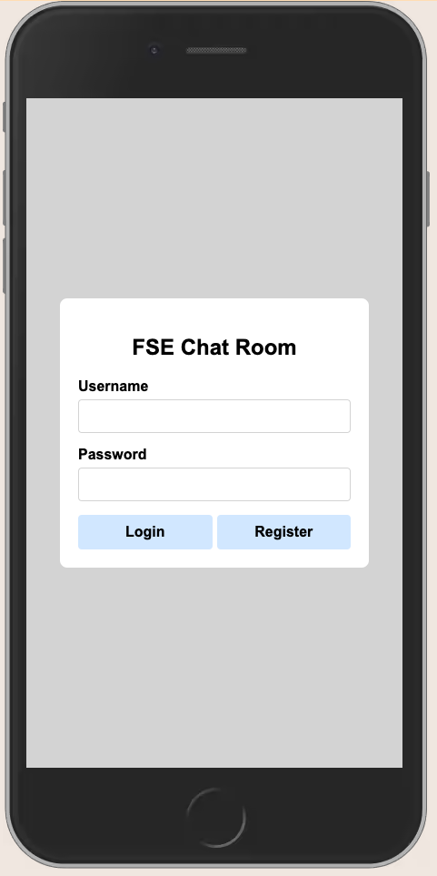
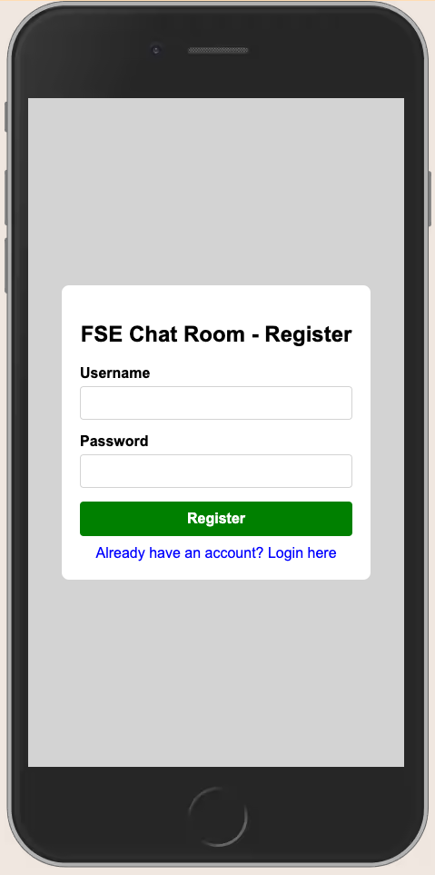
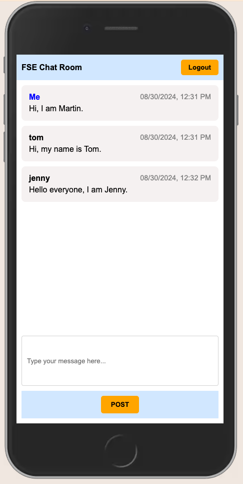

# FSE Pre-Assignment 2024 Fall - Chat Application

## Overview

This project is a real-time chat application that allows users to register, log in, and participate in a chat room where they can send and read messages instantly. 
Demo Video: https://www.youtube.com/watch?v=rPgoKitCbP8

## Table of Contents

- [Features](#features)
- [Setup Instructions](#setup-instructions)
- [Technologies Used](#technologies-used)
- [Project Structure](#project-structure)
- [Frontend Overview](#frontend-overview)
- [Backend Overview](#backend-overview)
- [Database Schema](#database-schema)
- [Usage](#usage)
- [Screenshots](#screenshots)

## Features

- User Registration and Login
- Real-time Messaging with Socket.io
- Persistent Chat History stored in SQLite
- Responsive and User-friendly Interface
- Basic error handling for user interactions

## Setup Instructions

1. **Clone the Repository**

    ```bash
    https://github.com/yuhaoy-cmu-F24/FSE-Pre-Assignment-24F-YUHAO-YANG.git
    cd FSE-Pre-Assignment-24F-YUHAO-YANG.git
    ```

2. **Install Dependencies** 

    ```bash
    npm install
    ```

3. **Start the Server** 

    ```bash
    npm start
    // or
    node server.js 
    ```

    The server will start on `http://localhost:3000`.

4. **Existing Users** 

Feel free to log in with the following existing users to experience the application without registration:

- **User1**:
  - **Username**: `martin`
  - **Password**: `123`

- **User2**:
  - **Username**: `tom`
  - **Password**: `123`

- **User3**:
  - **Username**: `jenny`
  - **Password**: `123`

## Technologies Used

### Frontend

- **HTML5**: Used for structuring the web pages.
- **CSS**: Applied for styling of the application.
- **JavaScript**: Implements client-side functionality and event handling.
- **Socket.io**: Used on the client side for real-time communication with the server.

### Backend

- **Node.js**: A JavaScript runtime environment used to build the server side of the application.
- **Express.js**: Node.js web application framework.
- **SQLite**: A lightweight database used to store user data and chat messages.
- **Socket.io**: A library for real-time web applications, enabling bi-directional communication between the client and server.

## File Structure
```
public
│   ├── chat.html           
│   ├── login.html          
│   ├── register.html       
│   ├── chat.css            
│   ├── login.css          
│   ├── register.css       
│   ├── chat.js             
│   ├── login.js            
│   ├── register.js         
├── server.js               
├── package.json            
├── reference.txt           
├── package-lock.json       
└── README.md               
```


## Frontend Overview

The frontend of this application is composed of three main pages:

1. **Registration Page (`register.html`)**

2. **Login Page (`login.html`)**

3. **Chat Room (`chat.html`)**


## Backend Overview

The backend is powered by Node.js and Express, with the following key components:

1. **Server Setup (`server.js`)**

2. **Database Integration (`server.js`)**

## Database Schema

The database schema consists of two main tables:

- **Users Table**:

```
CREATE TABLE IF NOT EXISTS users (
	id INTEGER PRIMARY KEY AUTOINCREMENT,
	username TEXT UNIQUE,
	password TEXT
);
```
- **Message Table**:

```
CREATE TABLE messages (
    id INTEGER PRIMARY KEY AUTOINCREMENT,
    user_id INTEGER,
    message TEXT,
    timestamp TEXT,
    FOREIGN KEY (user_id) REFERENCES users(id)
);
```


## Usage

1. **Registration:**

   - Go to the registration page (`/register`).
   - Enter a username and password to create an account.
   - Upon successful registration, you will be redirected to the login page.

2. **Login:**

   - Go to the login page (`/login`).
   - Enter your username and password to log in.
   - After successful login, you will be taken to the chat room.

3. **Chat Room:**

   - In the chat room, you can send messages that will be broadcast to all connected users in real-time.
   - Messages are stored in the database, so the chat history will be retained even if you refresh the page.


## Screenshots

Here are some screenshots of the application in action:

- **Login Page:**

  <br>

  <br>

- **Registration Page:**

  <br>

  <br>

- **Chat Room:**

  <br>
